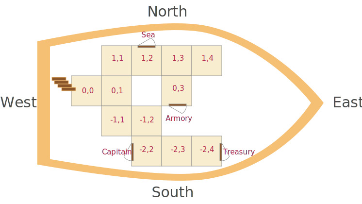
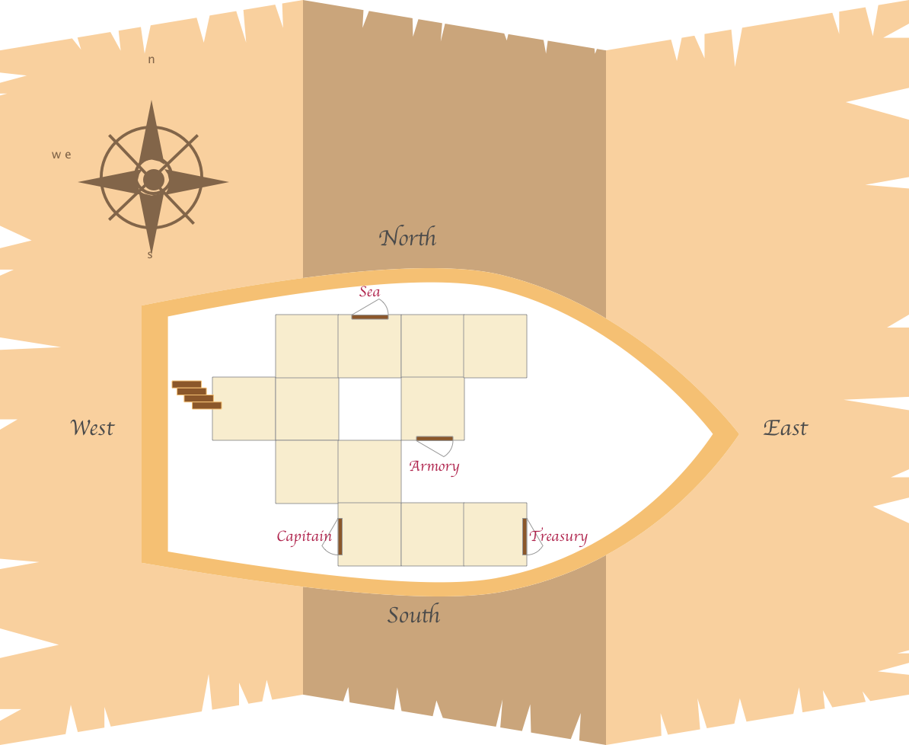

# mim_python_assignment


This repository contains code for Niklas' assignment: Jack Sparrow's Treasury Hunt!

The assignment description an be found in documentation > MiM Python Group Assignment 2021.pdf

For prototyping jupyter notebooks are used (folder notebooks).

The final assignment file is the ```jack_sparrow_treasury_hunt.py```.

## The labyrinth



This picture shows the labyrinth of the game with the different rooms.

Further the ```assets``` folder contains images of the rooms e.g.


That are dsplayed when looking into the room.

And images for objects e.g.


that are displayed in the inventory, and can be picked.

Additionally, I thought of one cool feature that needs to be implemented,
the asset


contains the boat plan, and one could always have a look at the map and see his own position or something like that.

These visualizations need to be implemented.

